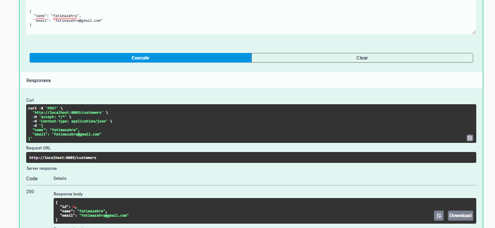
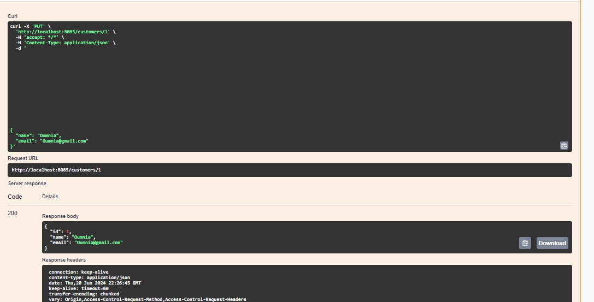
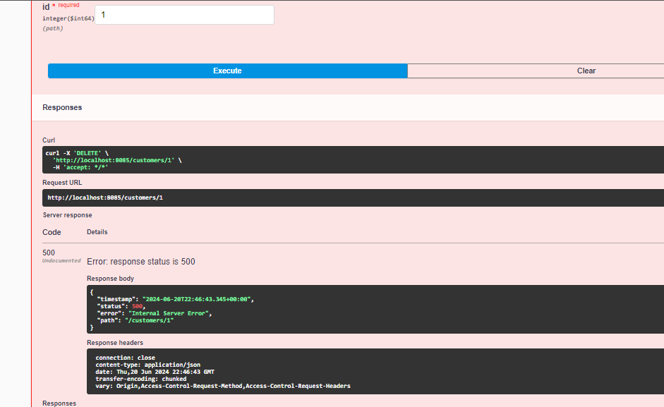
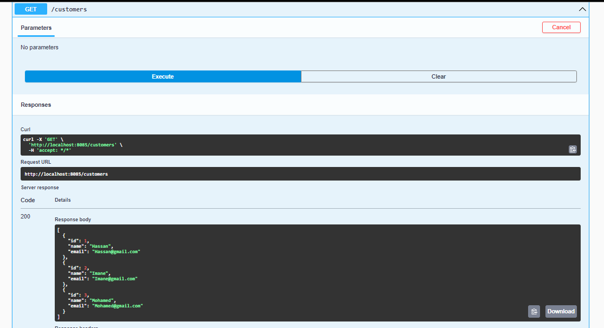
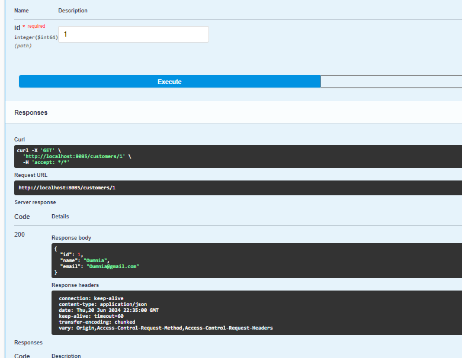
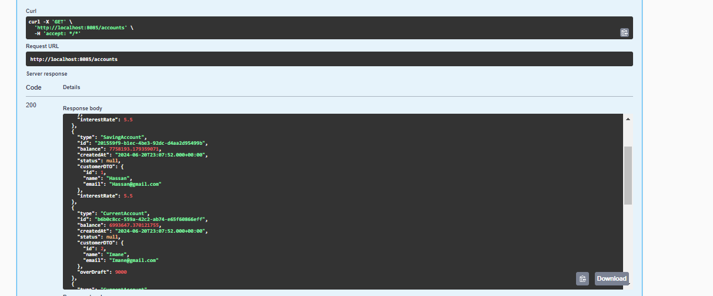
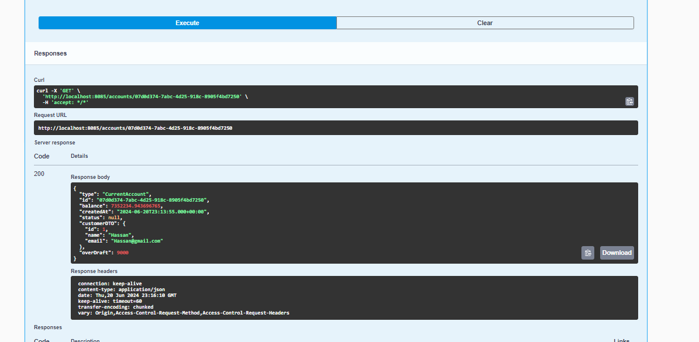
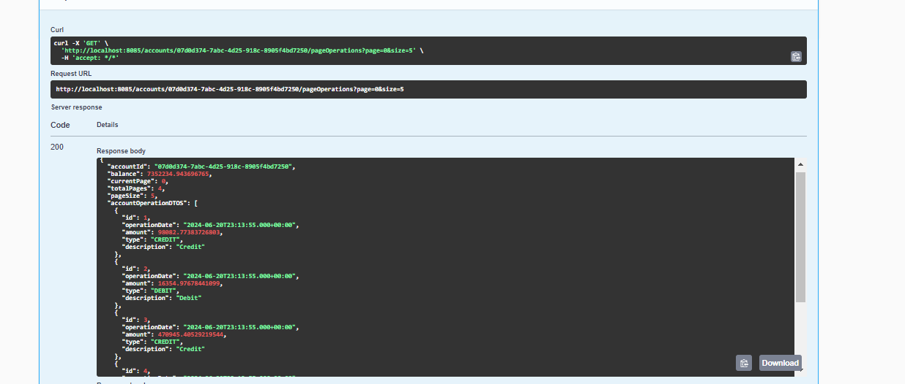
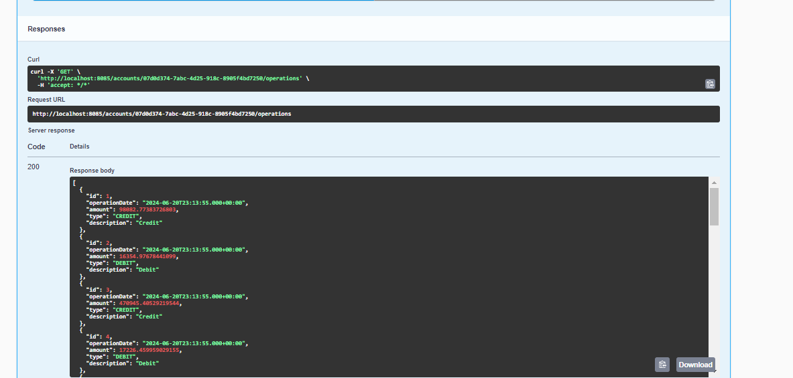

<h1>Compte rendu backend</h1>
<h2>Clients</h2>
<h3>1/Ajouter Client</h3>

<h3>2/Modifier Client</h3>

<h3>3/Supprimer Client</h3>

<h3>4/Consulter l'ensemble des Clients</h3>

<h3>5/Consulter un client</h3>

<h2>Comptes</h2>
<h3>1/Afficher les comptes</h3>

<h3>2/Afficher comptes par Id</h3>

<h3>3/Afficher les comptes par Id avec pagination</h3>

<h3>4/Afficher les opperations par Id de compte</h3>
